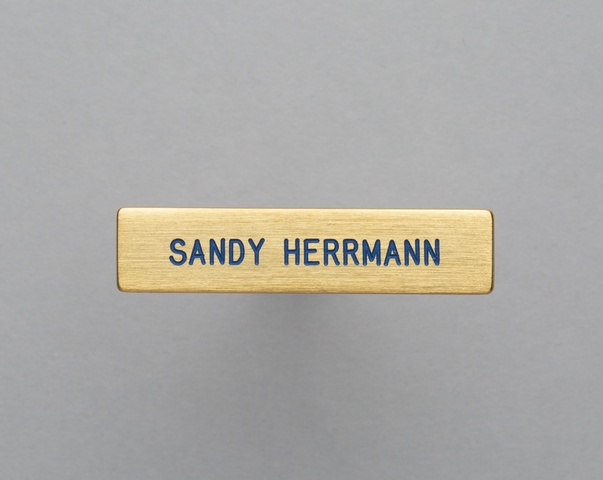
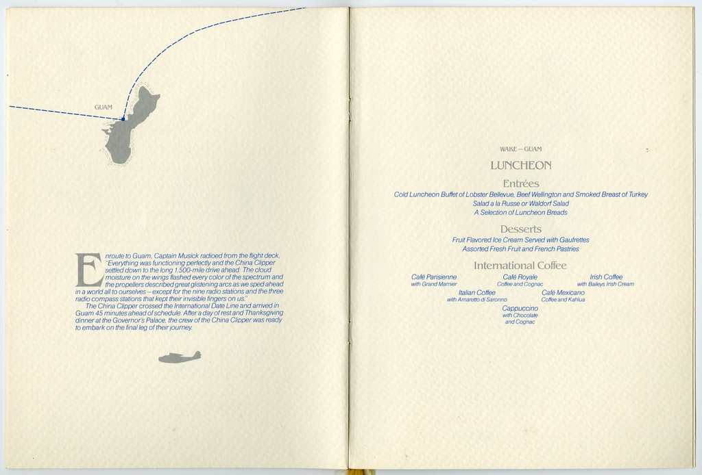
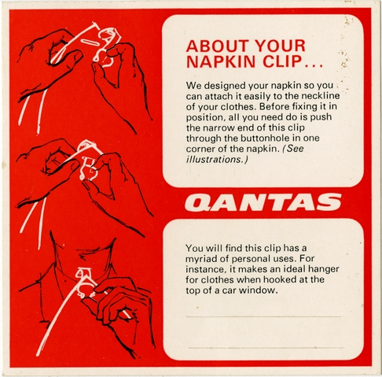

# swift-text-emboss-cli

Command line tool for extracting text from images using Apple's Vision framework.

## Important

This tool requires Mac OS 10.15 or higher.

## Example

All of the images in these examples are included in the [fixtures](fixtures) directory.

```
$> swift build

$> ./.build/debug/text-emboss -h
USAGE: text-extract-cli <input-file> [--as-json <as-json>]

ARGUMENTS:
  <input-file>            The path to an image file to extract text from.

OPTIONS:
  --as-json <as-json>     Emit the response as a JSON string. (default: false)
  -h, --help              Show help information.
```

[](https://collection.sfomuseum.org/objects/1762939445/)

```
$> ./.build/debug/text-emboss ./fixtures/sfomuseum-pin-2019.081.021.jpg 
SANDY HERRMANN
```

[](https://collection.sfomuseum.org/objects/1511924565/)

```
$> ./.build/debug/text-emboss ./fixtures/sfomuseum-menu-2000.058.1457.jpg 
GUAM
WAKE -GUAM
LUNCHEON
Entrées
Cold Luncheon Buffet of Lobster Bellevue, Beef Wellington and Smoked Breast of Turkey
Salad a la Russe or Waldorf Salad
A Selection of Luncheon Breads
Desserts
Fruit Flavored Ice Cream Served with Gaufrettes
proute Guam. Captain Musick radioed from the flight deck,
Assorted Fresh Fruit and French Pastries
Everything was functioning perfectly and the China Clipper
settled down to the long .500-r drive ahead. The cloud
International Coffee
moisture on the wings flashed every color of the spectrum and
Café Parisienne
Café Royale
Irish Coffee
the propellers described great glistening arcs as we sped ahead
with Grand Marier
Collee and Cognac
with Baileys Irish Cream
a world al to ourselves - except for the nine radio stations and the three
radio compass stations that kept their invisible fingers on us.
Italian Coffee
Café Mexicano
with Amaretto di Saronno
The China Clipper crossed the International Date Line and arrived in
Coffee and Kahlua
Guam 45 minutes ahead of schedule. After a day of rest and Thanksgiving
Cappuccino
dinner at the Governor's Palace, the crew of the China Clipper was ready
with Chocola
to embark on the final leg of their journey.
/ Cognac
```

[](https://collection.sfomuseum.org/objects/1729564805/)

```
$> ./.build/debug/text-emboss ./fixtures/sfomuseum-clip-2011.058.005.jpg 
ABOUT YOUR
NAPKIN CLIP...
We designed your napkin so you
can attach it easily to the neckline
of your clothes. Before fixing it in
position, all you need do is push
the narrow end of this clip
through the buttonhole in one
corner of the napkin. (See
illustrations.)
QANTAS
You will find this clip has a
myriad of personal uses. For
instance, makes an ideal hanger
for clothes when hooked at the
top of a car window.
```

### JSON

The return provenance and creation time for the text extracted from an image pass the `--as-json` flag which will return a JSON-encoded dictionary containing that information.

```
$> ./.build/debug/text-emboss --as-json true ./fixtures/sfomuseum-pin-2019.081.021.jpg | jq
{
  "source": "com.apple.visionkit.VNImageRequestHandler#Version 14.1.2 (Build 23B92)",
  "text": "SANDY HERRMANN",
  "created": 1701891195
}
```

Note: The `source` key is an arbitrary string used to identify the processes, or models, from which image text was derived. As of this writing this string has no standard formatting or requirements. If and when those conventions are established this package will be updated to use them.

## See also

* https://github.com/sfomuseum/swift-text-emboss
* https://developer.apple.com/documentation/vision
* https://collection.sfomuseum.org/objects/1762939445/
* https://collection.sfomuseum.org/objects/1511924565/#1729566967
* https://collection.sfomuseum.org/objects/1729564805/
